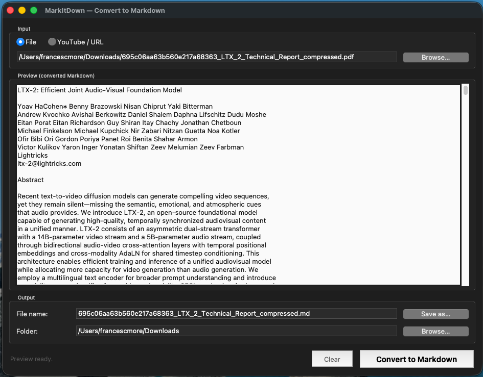

# MarkItDown GUI

Desktop app to convert documents to Markdown — no Python required.  
Built on Microsoft's [markitdown](https://github.com/microsoft/markitdown) library.



---

## Download

| Platform | Download |
|---|---|
| Windows 10/11 | [MarkItDown-Windows.zip](../../releases/latest) → extract and run `MarkItDown.exe` |
| macOS (Apple Silicon & Intel) | [MarkItDown-Mac.zip](../../releases/latest) → extract, run `xattr -cr MarkItDown.app`, then open |
| Linux | See [HOWTO.md](HOWTO.md) to compile from source |

---

## Supported formats

| Format | Extensions |
|---|---|
| PDF | `.pdf` |
| Word | `.docx`, `.doc` |
| Excel | `.xlsx`, `.xls` |
| PowerPoint | `.pptx`, `.ppt` |
| Web | `.html`, `.htm` |
| Text & data | `.txt`, `.csv`, `.json`, `.xml` |
| E-book | `.epub` |
| Images | `.png`, `.jpg`, `.jpeg`, `.gif`, `.bmp`, `.tiff` |
| Jupyter Notebook | `.ipynb` |
| Outlook | `.msg` |
| Audio WAV | `.wav` *(requires internet, uses Google Speech)* |
| Audio MP3/MP4 | `.mp3`, `.mp4` *(also requires [ffmpeg](https://ffmpeg.org))* |
| YouTube URL | YouTube URL *(requires internet)* |

---

## How to use

1. Select a file with **Browse…** or paste a YouTube URL
2. Check the Markdown preview
3. Adjust the output file name and folder if needed
4. Click **Convert to Markdown**

---

## Platform notes

### Windows
The first time you run the app, Windows SmartScreen may show a security warning
because the executable is not digitally signed.
Click **"More info" → "Run anyway"** to continue.

### macOS
macOS Gatekeeper may block the app on first launch. Open Terminal and run:
```bash
xattr -cr MarkItDown.app
```
Then double-click the app normally.
Or go to System Settings → Privacy & Security → click "Open Anyway".

---

## Build from source

See [HOWTO.md](HOWTO.md) for full build instructions on Windows, Mac and Linux.

---

## License

MIT — see [LICENSE](LICENSE)
